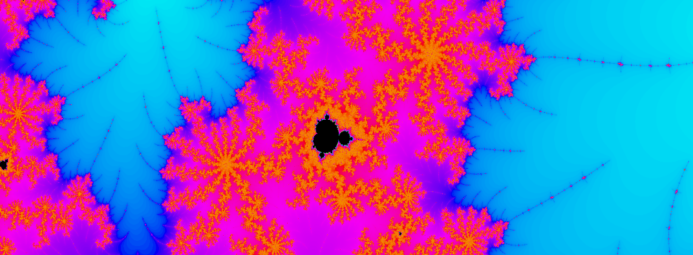

# Simple Mandelbrot renderer

<p align="center">

</p>


This project mainly serves as an exercise for the Rust programming language  and its ecosystem. The goal is to create a simple Mandelbrot renderer that can be used to create images of the Mandelbrot set.

## Usage

```
cargo run --release
```

```
mandelbrot 0.1.0

USAGE:
    mandelbrot [OPTIONS]

OPTIONS:
    -h, --height <HEIGHT>                    [default: 256]
        --help                               Print help information
    -m, --max-iterations <MAX_ITERATIONS>    [default: 255]
    -o, --output <OUTPUT>                    [default: out.ppm]
    -s, --scale <SCALE>                      [default: 1]
    -V, --version                            Print version information
    -w, --width <WIDTH>                      Name of the person to greet [default: 256]
    -x, --x <X>                              [default: 0]
    -y, --y <Y>                              [default: 0]
    -z, --zoom <ZOOM>                        [default: 1]
```

## Todo 

- [x] Render the Mandelbrot set
- [x] Multi-threaded rendering 
- [x] Add a CLI
- [ ] Add alternative color gradients
- [x] Zooming and panning
